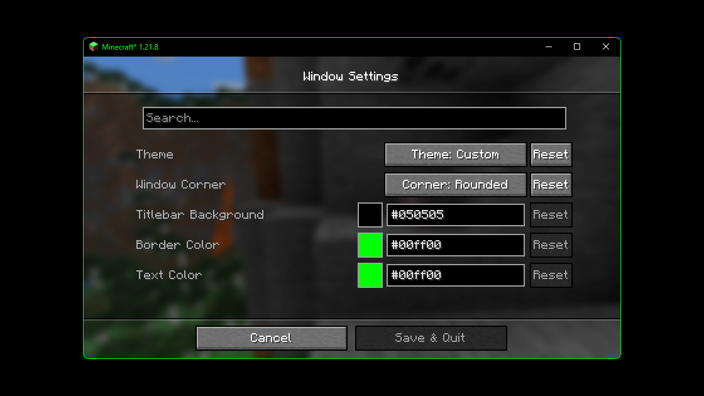
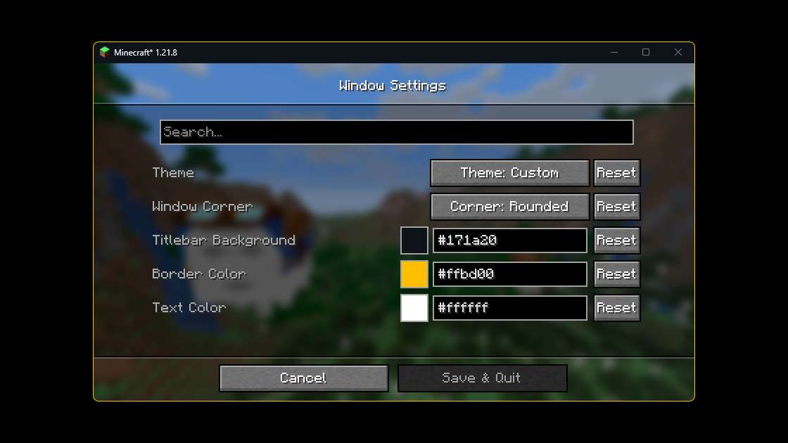
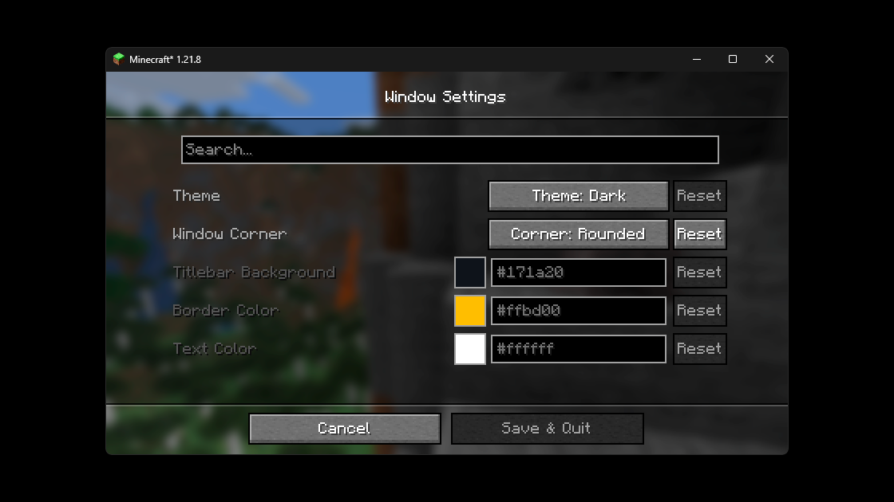
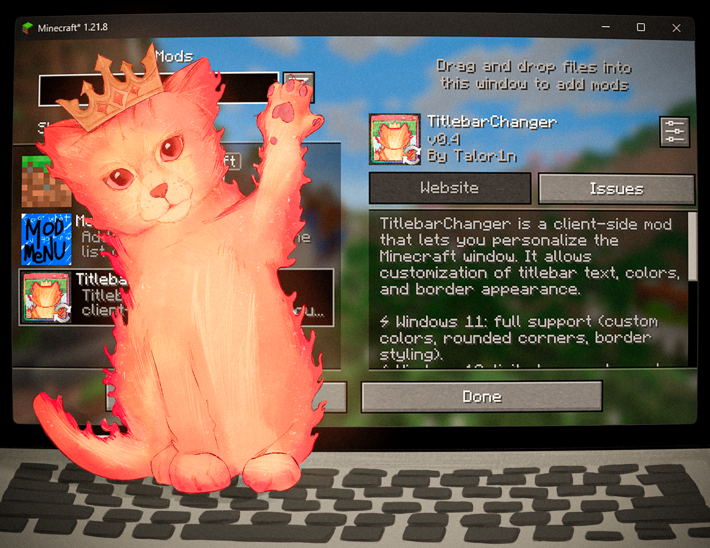
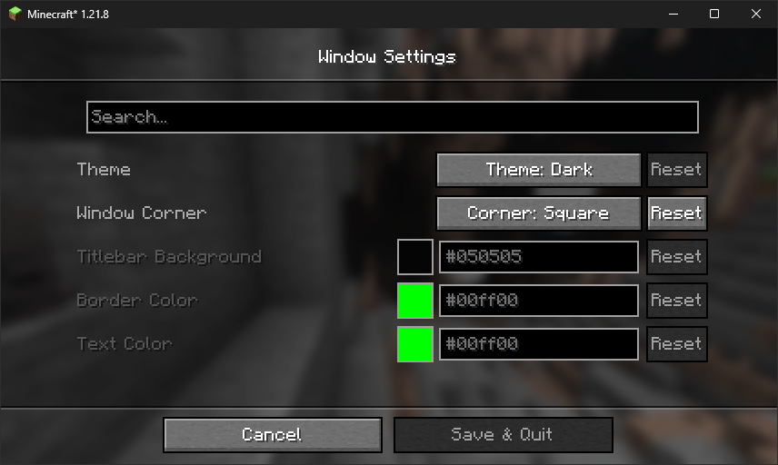

# 🔄Titlebar Changer

Personalize the look of your Minecraft **window titlebar** — tweak **colors, text, corners, and borders** on Windows.

- 🪟 On **Windows 11**, the mod unlocks the full range of customization features, such as custom colors, rounded corners,
  and border styling.
- 🪟 On **Windows 10**, support is limited by the operating system: you can only switch the titlebar between light and
  dark modes.

## 📦 Download

| Platform   | Link                                                                                |
|------------|-------------------------------------------------------------------------------------|
| Modrinth   | [Download on Modrinth](https://modrinth.com/project/titlebar-changer)               |
| CurseForge | [Download on CurseForge](https://curseforge.com/minecraft/mc-mods/titlebar-changer) |

## ✅ Requirements

* **Windows 10 or Windows 11** (other OS are not supported)
* One of: **Forge** or **Fabric/Quilt**
* (Optional, for in‑game settings): **[Cloth Config API](https://modrinth.com/mod/cloth-config)**
* (Optional, Fabric/Quilt config UI): **[Mod Menu](https://modrinth.com/mod/modmenu)**

## 🎨 Examples

Below are examples of custom titlebar colors (Windows 11):

  
  


### 🐱 Fun Example
And here’s an extra — the *Titlebar Changer* with my cat wearing a crown 👑



## 🛠️ Installation

### ⚒️Forge / 🦊NeoForge

1. Download the **Titlebar Changer** jar from Modrinth/CurseForge.
2. Put it into your Minecraft **`mods/`** folder.
3. (Optional) Add **Cloth Config** to enable the in‑game config screen.
4. Launch the game.

### 🧶Fabric / 🧵Quilt

1. Download the **Titlebar Changer** jar from Modrinth/CurseForge.
2. Put it into your Minecraft **`mods/`** folder.
3. (Optional) Add **Cloth Config** (and **Mod Menu** for a convenient entry point).
4. Launch the game.

---

## ⚙️ Configuration

You can configure the mod either **in‑game** (recommended) or by editing the **JSON** file.

### In‑game config

* **Forge:** Main Menu → **Mods** → *Titlebar Changer* → **Config**
* **Fabric/Quilt:** Install **Mod Menu** + **Cloth Config**, then Main Menu → **Mods** → *Titlebar Changer*



### Config file

The file lives at: **`config/titlebar_settings.json`**

```json5
{
  // Window Theme: LIGHT (0), DARK (1), CUSTOM (2)
  // Controls the overall appearance of the titlebar
  // Restriction: Custom only works on Windows 11+
  "theme": "1",

  // Window Corners: SYSTEM_DEFAULT (0), NO_ROUNDING (1), ROUNDED (2), ROUNDED_SMALL (3)
  // Controls how window corners are rendered
  // Restriction: Only works on Windows 11+
  "corner": "0",

  // Caption (titlebar) background color
  // Format: #RRGGBB
  // Restriction: Only works when theme is CUSTOM (2)
  "captionColor": "#FF0505",

  // Window border color
  // Format: #RRGGBB
  // Restriction: Only works when theme is CUSTOM (2)
  "borderColor": "#FF00FF",

  // Title text and button color
  // Format: #RRGGBB
  // Restriction: Only works when theme is CUSTOM (2)
  "textColor": "#FF00FF"
}
```

#### Option reference

| Option         | Values / Format                                                                | Notes                                                                                              |
|----------------|--------------------------------------------------------------------------------|----------------------------------------------------------------------------------------------------|
| `theme`        | `0` = Light • `1` = Dark • `2` = Custom                                        | On **Windows 10** only `0/1` are supported. Full customization (`2`) works only on **Windows 11**. |
| `corner`       | `0` = System default • `1` = No rounding • `2` = Rounded • `3` = Rounded small | Available only on **Windows 11**.                                                                  |
| `captionColor` | `#RRGGBB`                                                                      | Used only with `theme = 2` (Custom).                                                               |
| `borderColor`  | `#RRGGBB`                                                                      | Used only with `theme = 2` (Custom).                                                               |
| `textColor`    | `#RRGGBB`                                                                      | Used only with `theme = 2` (Custom).                                                               |

> Tip: restart the game after manual edits.
---

## ❓ FAQ

**Does it work on Linux or macOS?**
The mod uses Windows APIs. On non‑Windows systems it will **load in dormant mode** (inactive, no changes applied).

**Does it work in fullscreen?**
The titlebar is part of the **windowed** UI. Fullscreen modes that hide the window frame will also hide the titlebar.

**Can I use hex colors with alpha (#AARRGGBB)?**
No — use **`#RRGGBB`**.

---